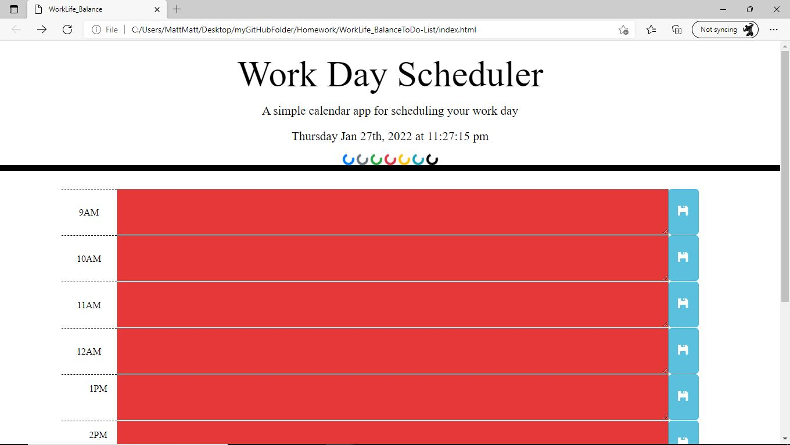

# WorkLife_BalanceToDo-List

# Name: Work Day Scheduler

##

I successfully Created a simple calendar application that allows a user to save events for each hour of the day by modifying starter code. This app runs in the browser and feature dynamically updated HTML and CSS powered by jQuery.

## Description

*I am using a daily planner to create a schedule

*When planner is open the current day is displayed at the top of the calendar

*Scroll down and you will be presented with timeblocks for standard business hours

*When user views the timeblocks for that day each timeblock is color coded to indicate whether it is in the past, present, or future

* When user clicks timeblock then user can enter an event

*When User click the save button for that timeblock the text for that event is saved in local storage
*When user refresh the page the saved events persist.
Enjoy

### Deployment: 

<!-- *I Deployed a live URL on github  -->

*My Application loads with no errors

* My Application URL submitted on bootcamp

* My GitHub repo contains application code

* My Application is intuitive and easy to navigate

*My  Application user interface style is clean and polished

* My Application resembles the mock-up functionality provided in the homework instructions

* Repository has a unique name

* My Repository follows best practices for class/id naming conventions, indentation, quality comments, etc.

* My Repository contains multiple descriptive commit messages

* My Repository contains quality README file with description, screenshot, and link to deployed application

# Screenshot

© 2022 Trilogy Education Services, LLC, a 2U, Inc. brand. Confidential and Proprietary. All Rights Reserved.
